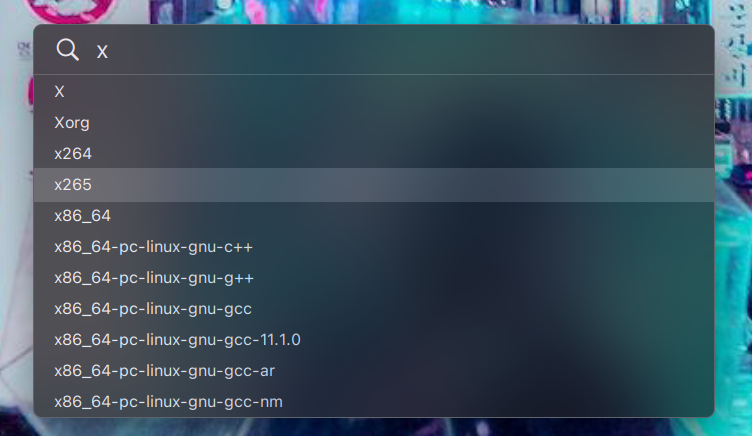

# OpenBSD-patches
Assorted patches, work very much in progress

## In th repository

### cwm-magnet.diff

Added the following functions to match the Magnet.app behavior from MacOS:

* `window-tile-up`: Fill the top half of the screen with the window.
* `window-tile-down`: Fill the bottom half of the screen with the window.
* `window-tile-left`: Fill the left half of the screen with the window.
* `window-tile-right`: Fill the right half of the screen with the window.
* `window-tile-up-left`: Fill the top left quarter of the screen with the window.
* `window-tile-up-right`: Fill the top right quarter of the screen with the window.
* `window-tile-down-left`: Fill the down left quarter of the screen with the window.
* `window-tile-down-right`: Fill the down right quarter of the screen with the window.
* `window-center`: Centers the window on the screen.

### cwm-hide-groups-when-cycling.diff

Adds function that cycles between window groups, keeping window focus in each group.

### cwm-rounded-corners.diff

Adds rounded corners to windows. You can set the desired corner radius in your cwmrc file.

### cwm-menu-hint.diff

Adds `WM_CLASS`  and `WM_NAME` hint to the menus, making it possible to style them with compositors, such as picom or compton. Both values default to the `wm` property value (CWM).

### cwm-menu-customization.diff

Adds a multitude of options to customize the look and feel of the menus:

* `menucenter`: When set, all menus will be automatically centered on the screen.  If `menumaxitems` is set, maximum number of visible items will be used to calculate the maximum possible height of the menu, and centering will be based on this number. If not, the top line of the menu will be centered.
* `menuindent pixels`: If `menuwidth` is set, this setting will set the left ident of all menu items.  If not, it will set both left and right indent.
* `menuitemheight pixels`: Sets the height of the menu items. If not set, it defaults to the height of the menu font.
* `menumaxitems number`: Set the maximum number of displayed menu items. if not set, it defaults to displaying unlimited number of items.
* `menupos x y`: If set, all menus will appear at given x and y coordinates instead of the current cursor position.
* `menuprefix string`: If set, it prefixes the entered phrase with string.  If not set, it defaults to >>.
* `menusuffix string`: If set, it suffixes the entered phrase with string.  If not set, it defaults to <<.
* `menutitle type string`: Override the default title of the menu type with string.  The type can be one of `application` `exec` `group`, `label`, `ssh`, `window` or `wm`.
* `menutitlefontname font`: If set, it overrides the default `font` setting for the menu title and the search phrase.
* `menutitleheight pixels`: Set the height of the menu header to pixels.  If not set, it defaults to the height of the `menutitlefontname` or `fontname`.
* `menuwidth pixels`: Set width of the menu to pixels.  If not set, it defaults to the widest menu item plus twice the `menuindent` if set.

### ksh-ignorecase.diff

Adds new `ignorecase` property which, when enabled, makes tab completions case insensntive
